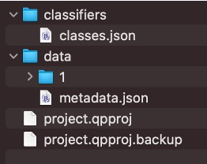
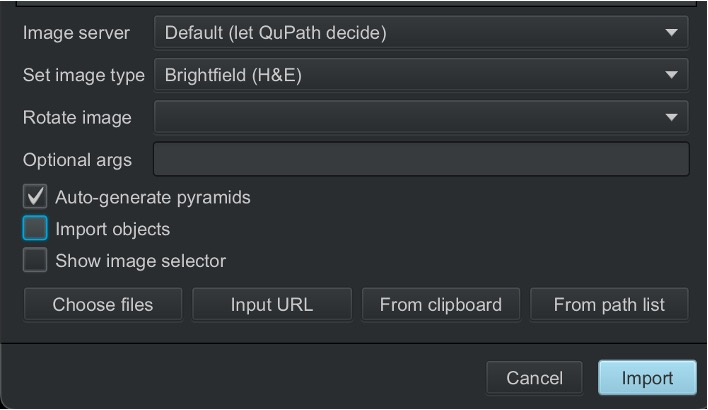
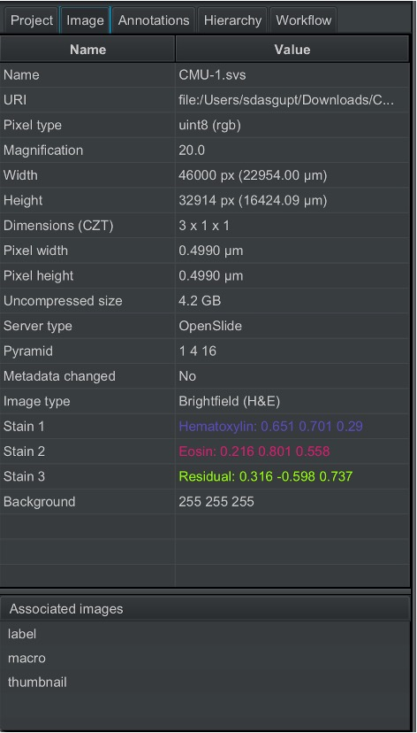
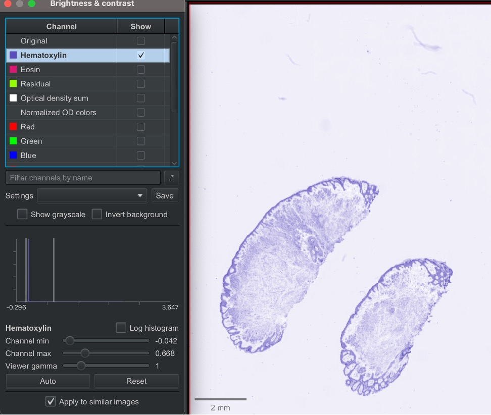

# Day 3, session 3: Practical introduction to QuPath

*Lab author: Shatavisha Dasgupta* . 

Adapted from:
1. [QuPath documentation](https://qupath.readthedocs.io/en/stable/docs/tutorials/index.html)
2. [Pete Bankhead's video tutorial](https://youtu.be/xtjsigsUrms?si=PLyccu1S0xfYJHYN)
3. [From Samples to Knowledge 2025 Repo](https://saramcardle.github.io/FS2K/README.html)

## **Learning Objectives**
This tutorial provides an overview of the basic functionalities of QuPath.
Specifically, the tutorial covers the following:
- Creating a QuPath project
- Viewing pyramidal files
- Setting channel names of images
- Manually annotating regions of interest
- Detecting cells in the annotated regions
- Performing measurements on the detected cells and exporting the data

**Lab Data** in [this folder](https://drive.google.com/drive/folders/1z0FnjmPLGjEnIpPu_P8PTB-4ck6Z9BcA?usp=drive_link) (Originally sourced from [here](https://openslide.cs.cmu.edu/download/openslide-testdata/Hamamatsu/) and [here]((https://openslide.cs.cmu.edu/download/openslide-testdata/Aperio/CMU-1.svs)))

---

## **1. Background information**

### 1.1 What is QuPath?

QuPath is an open source software for bioimage analysis created and maintained by Peter Bankhead and his team at The University of Edinburgh. QuPath is commonly used for **digital pathology in research** because it offers a powerful set of tools for working with **whole slide images** - but it can be applied to lots of other kinds of image as well.

Read the [original publication introducing QuPath](https://doi.org/10.1038/s41598-017-17204-5)!

QuPath provides powerful tools for **annotation, visualization, and image analysis** through an easy-to-use modern interface. It includes built-in algorithms for cell and tissue detection, interactive machine learning for object and pixel classification, and supports many image formats, including whole-slide and multiplexed images. It also integrates with tools like ImageJ, OpenCV, OMERO, StarDist, InstanSeg, and Bio-Formats, and the functionalities can be expanded using Groovy scripts and extensions. Many of these functionalities are beyond the scope of this tutorial -- if you are interested, [QuPath docs](https://qupath.readthedocs.io/en/stable/docs/tutorials/index.html) and these videos/channels ([1](https://www.youtube.com/playlist?list=PLlGXRBscPbCCA1yGCThNqdYKgTPOvjigp), [2](https://www.youtube.com/playlist?list=PLSCpSsEmyRpANBGQXB_oGslW9NIJz4A12), [3](https://www.youtube.com/playlist?list=PL4ta8RxZklWkPB_pwW-ZDVAGPGktAlE5Y)) are great resources to delve into!

### 1.2 What are pyramidal file formats?
- Whole slide images (WSIs) are a crucial component of translational research focussing on Histopathology, because they allow comparing changes in diseased tissue with healthy tissue, which are often present on the same slide. Additionally, they also allow quantifying parameters of prognostic significance, such as depth of invasion of tumors
- WSIs contain a wealth of information -- and billions of pixels -- so these tend to be of substantial size, often exceeding 10 GB
- To make viewing, processing, and analysis more efficient, WSIs are commonly stored in pyramidal file formats
- A pyramidal file stores the same image at multiple resolutions within a single file. These resolutions are arranged in a pyramid-like hierarchy, with the full-resolution image at the base and progressively lower-resolution versions above it
- This allows the software to load only the resolution needed for a given zoom level, rather than loading the entire high-resolution image into memory
- In histology, this is especially useful because low-resolution views allow rapid navigation across the tissue, while high-resolution views allow detailed examination of cellular and tissue structures
- As shown in the figure, pyramidal images are typically organized as:
  - Level 0: Full-resolution image
  - Higher levels: Downsampled versions, such as 1/2, 1/4, or 1/8 scale
  

- Common use cases include:
  - Digital pathology: .svs, .scn, .ndpi, .tiff
  - Spatial biology: .tiff, .ome.tiff
  - Geospatial imaging: GeoTIFF
- Pyramidal file formats offer several advantages for large-image analysis:
  - Faster loading and rendering
  - Lower memory usage during visualization
  - Efficient low-resolution previews
  - Region-of-interest extraction without decoding the entire image
- Limitations:
  - Pyramidal files can be larger because they store multiple resolutions
  - They often require specialized software for reading, writing, or processing
- Common File Formats:
  - TIFF-based formats such as .tiff and .ome.tiff
  - Vendor-specific formats such as .svs (Aperio), .ndpi (Hamamatsu), or .scn (Leica)
- These files can be read using tools such as:
  - OpenSlide
  - Bio-Formats
  - pyvips
  - tifffile
  - QuPath

## **2. Exercise steps**

 - [2.1 Install QuPath](#21-install-QuPath)
 - [2.2 Launch QuPath](#22-launch-QuPath)
 - [2.3 Create a QuPath project](#23-create-a-qupath-project)
 - [2.4 View an image](#24-view-an-image)

### 2.1 Install QuPath

Please install the latest version from [here](https://qupath.github.io/)

### 2.2 Launch QuPath

Click on the QuPath icon, and wait for QuPath to launch.
When the QuPath window opens, you will notice the welcome screen, which links to QuPath documentation, the [image analysis forum](forum.image.sc), and also the [source code](https://github.com/qupath/qupath)

### 2.3 Create a QuPath project
Although it is possible to view and work with single images in QuPath, creating a "Project" makes saving and reloading data associated with multiple images much more efficient. A QuPath project groups related images to easily switch between them via thumbnails and also organizes associated data files, scripts, and classifiers.

  #### *A. Create a new / choose a project folder*
  We start by creating a "project folder", which can be any folder, stored anywhere on your computer, but it **must be empty**.

  This can be done by doing either of the following:
  1. Click on `File`; then `Project` and `Create project`

  

  2. Clicking on the `Create project` button in the analysis pane

  3. Dragging and dropping the project folder into QuPath

  You can name the project anything you like -- for this example, I have named it `qupath_project`.
  You will notice the project name will appear in the analysis pane.

  

  #### *B. Add images to your project*
  You can add images via `File --> Project... --> Add images`, or, you can drag and drop the images into QuPath. This will open a dialog box, where you can set parameters related to the image being imported.

  

### 2.4 View an image

Click the **Image** tab to get a table of properties related to your image.

The **scroll wheel** of your mouse (or equivalent scrolling motion on a trackpad) can be used to **zoom in and out** of an image within QuPath.
You can visualize the different stains in your image individually by clicking `View --> Brightness and Contrast` and choose the specific stains / channels to view

### 2.4 Annotate regions of interest
**Annotation objects** can be created by drawing specific shapes on the image, using rectangle / circle / polygon tools. One can also use the brush tools to draw custom shapes. This can be done by selecting the tool, clicking on the image, and dragging the mouse. Creating annotation objects allows us to define regions within which we can perform detections. Right-clicking on an annotation "locks" it, and prevents it from getting accidentally deleted. One can make annotations of different classes in QuPath and information regarding the class to which the annotation belongs can be entered by right clicking on the annotated area, and then clicking on `Set Classification`.

### 2.5 View annotation measurements
Within the **Analysis panel**, below the annotation list you should see a table showing measurements for the currently selected object. This updates automatically if another annotation is selected. Alternatively, you can click on `Measure --> Show annotation measurements`, and a table will pop-up showing the annotation measurements.

### 2.6 Detect cells
For this step, we will use the OS-2.ndpi image.
We will first open the image and annoate a region of interest.
Next, we will try to detect all the cells in the annotated area, and also obtain a count of cells that are positive for DAB-staining.
We will click on `Analyze --> Cell detection --> Positive Cell detection`. 

This opens up a window where we can set the parameters that will allow for accurate cell detection. Once the appropriate parameters are set, we can hit `Run`, and the cells will be detected.

The Annotations pane will show the count of all cells, positive cells and negative cells that were detected.

We can also visualize the detections as a heatmap overlaid on the image by clicking `Measure --> Show measurement maps`

### 2.7 Classify cells
We can next assign the positive cells that were detected to specific areas in the tissue, e.g. tumor or stroma. This can help us compare the counts or other characteristics of the positive cells in the tumoral or the stromal regions.
For this, we first annotate some regions within our region of interest as 'tumor' or 'stroma', and train the classifier `Classify --> Object classification --> Train object classifier`

We will now get the measurement of the positive cells stratified into the classes (tumor/stroma) that we set.

### 2.8 Perform and export measurements
QuPath makes some basic measuerements of the annotations and detections by default if no additional instruction is provided. However, more granular or more advanced measurements can also be made by clicking on `Analyze --> Calculate features` and then selecting the features that you would want to extract.

These measurements can also be viewed as a heatmap overlaid on the image by clicking `Measure --> Show measurement maps` or as a table by clicking `Measure --> Show detection measurements`

Finally, we export the measurements, by clicking `Measure --> Export measurements`  and selecting the measurements we want to export (e.g. measurements for all images / some images, annotation measurements, detection measurements) and also the file format in which we would want the measurements saved (e.g. .csv, .tsv)

You will see the file with the measurements saved in your QuPath project folder.

--------------------------------------------------------------------------------------------
--------------------------------------------------------------------------------------------

## Congrats! Now you know the basics of QuPath!

## Learn more about QuPath:
- [QuPath Repo](https://github.com/qupath)
- [QuPath docs](https://qupath.readthedocs.io/en/stable/)
- [QuPath YouTube Channel](https://www.youtube.com/@petebankhead/videos)

---